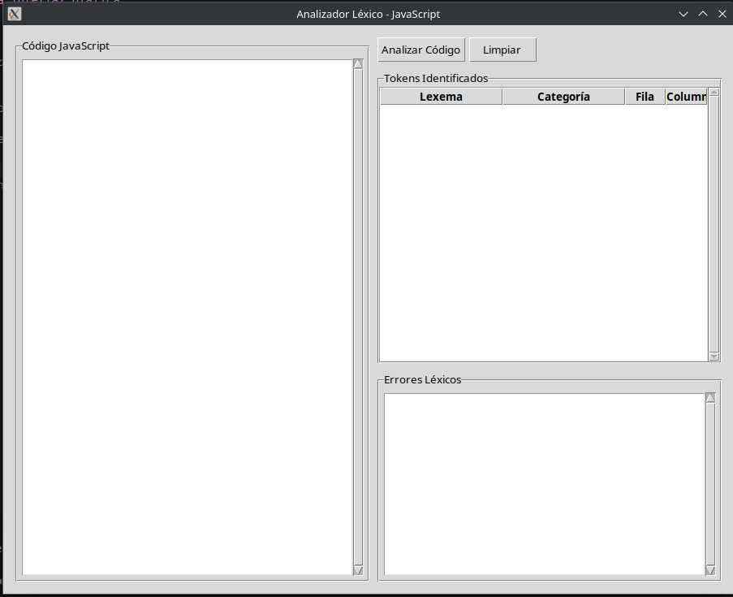

# Documentación del Analizador Léxico para TypeScript

## Descripción General
Este proyecto implementa un analizador léxico para TypeScript utilizando Autómatas Finitos Deterministas (AFD) y una interfaz gráfica desarrollada con Tkinter para facilitar la interacción.

## Guía de Uso
1. **Ejecución**: 
   ```bash
   python3 main.py
   ```
   Esto abrirá la interfaz gráfica.

2. **Carga de Archivos**: 
   - Utiliza el botón "Cargar Archivo" para seleccionar un archivo TypeScript.
   - El código se mostrará en el editor de texto.

3. **Análisis Léxico**: 
   - Haz clic en "Analizar" para procesar el código.
   - Los tokens identificados se mostrarán en la tabla, con colores según su categoría.
   - Los errores léxicos (si los hay) se mostrarán en el panel de errores.

4. **Exportación**: 
   - Utiliza el botón "Exportar" para guardar los resultados del análisis.

## Screenshots
[Incluir capturas de pantalla de la interfaz gráfica aquí]

## Descripción Funcional
- **Análisis Léxico**: Identifica y clasifica tokens como palabras reservadas, identificadores, números, cadenas, comentarios, operadores y símbolos.
- **Interfaz Gráfica**: Proporciona una interfaz intuitiva para cargar archivos, visualizar tokens y errores, y exportar resultados.
- **Manejo de Errores**: Reporta caracteres no reconocidos indicando su posición.

## Requisitos
- Python 3.6 o superior
- Tkinter (generalmente incluido en las instalaciones estándar de Python)

## Autores
- [Tu Nombre]
- [Otro Autor]

## Fecha
[Fecha de Entrega]

## Contenido

- [Documentación de Autómatas](automatas/README.md): Descripción formal de todos los autómatas finitos deterministas implementados, incluyendo expresiones regulares y diagramas de estados.
- [Requisitos Cumplidos](requisitos_cumplidos.md): Detalle de cómo el proyecto cumple con todos los requisitos especificados.

## Capturas de pantalla

Para obtener capturas de pantalla de la interfaz gráfica, ejecute la aplicación con el comando:

```bash
python3 main.py
```

Y capture la ventana que aparece. La interfaz del analizador léxico se ve así:



## Tokens reconocidos

El analizador léxico reconoce los siguientes tipos de tokens:

- Identificadores: nombres de variables, funciones, etc. (limitados a 10 caracteres)
- Números Naturales: secuencias de dígitos
- Números Reales: con punto decimal y/o notación científica
- Palabras Reservadas: var, let, const, if, else, etc.
- Cadenas de Caracteres: con comillas dobles, simples o acentos graves
- Comentarios: de línea (//) y de bloque (/* */)
- Operadores: aritméticos, de comparación, lógicos, de asignación, etc.
- Delimitadores: paréntesis, llaves, corchetes, punto y coma, etc.

## Detección de errores

El analizador detecta los siguientes tipos de errores léxicos:

1. Caracteres no reconocidos: símbolos que no pertenecen al lenguaje JavaScript
2. Cadenas de texto sin cerrar: cadenas que comienzan con comillas pero no terminan
3. Comentarios de bloque sin cerrar: comentarios que comienzan con /* pero no terminan con */ 